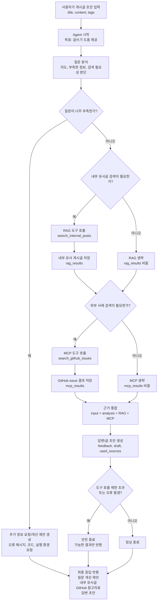
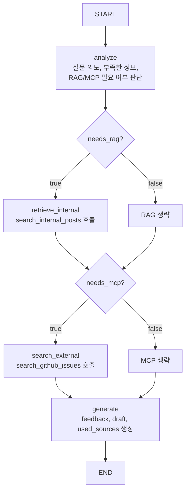

# 프로젝트 결정 기록

## 1. 확정된 프로젝트 방향

프로젝트 주제:

```text
AI 개발 Q&A 게시판
```

핵심 설명:

```text
사용자가 개발 질문을 작성하면,
기본 게시판 기능을 통해 질문과 답변을 관리하고,
나중에 RAG로 유사 게시글을 추천하며,
MCP로 외부 개발 정보를 조회하고,
Agent가 질문 개선과 답변 초안을 돕는 게시판을 만든다.
```

## 2. 확정 기술 스택

| 영역 | 선택 | 이유 |
|---|---|---|
| 프론트엔드 | React | 과제 요구사항을 만족하고, 프론트/백 역할 분리를 학습하기 좋다. |
| 백엔드 | FastAPI | API 구조가 선명하고, Python AI 생태계와 연결하기 쉽다. |
| 데이터베이스 | PostgreSQL | 과제 요구사항을 만족하고, 이후 pgvector 같은 확장도 고려할 수 있다. |
| 기본 API 방식 | REST API | 게시판 CRUD와 잘 맞고, 프론트/백 통신 구조를 이해하기 좋다. |
| 인증 방식 | JWT 기반 인증 | React와 API 서버 구조에서 흔히 쓰이고, 인증/권한 흐름을 학습하기 좋다. |

## 3. AI 기술 스택 결정 상태

기본 CRUD 게시판이 수동 테스트까지 통과했으므로 AI 기술 선택 단계로 넘어간다.
다만 AI 관련 세부 기술은 한 번에 모두 확정하지 않고, 영역별로 비교한 뒤 선택한다.

현재 확정하는 것은 LLM Provider, RAG 1차 기능, Vector DB, RAG Framework, 관찰 도구, 교체 가능 설계 원칙이다.

### 3.1 LLM Provider 1차 결정

| 항목 | 결정 | 이유 |
|---|---|---|
| LLM Provider | OpenAI | 현재 사용할 수 있는 OpenAI 크레딧이 있고, FastAPI/Python 환경에서 연동 자료와 SDK가 충분하다. |
| 사용 목적 | RAG 요약, 질문 개선, 답변 초안, Agent 응답 생성 | 게시판의 AI 기능이 언어 이해/생성 중심이기 때문이다. |
| 설계 원칙 | 교체 가능하게 구현 | 나중에 Claude, Gemini, 로컬 모델 등으로 바꿀 수 있도록 백엔드 내부에 얇은 AI 서비스 계층을 둔다. |

모델명은 코드 전체에 직접 흩뿌리지 않고 환경변수나 설정 파일에서 관리한다.
이렇게 하면 비용, 성능, 과제 요구에 따라 모델을 교체하기 쉽다.

예상 설정:

```text
AI_PROVIDER=openai
AI_CHAT_MODEL=gpt-5.4-mini
AI_EMBEDDING_MODEL=text-embedding-3-small
```

### 3.2 RAG 1차 기능 결정

| 항목 | 결정 | 이유 |
|---|---|---|
| RAG 사용 위치 | 게시글 작성 화면 | 사용자가 새 질문을 작성할 때 기존 유사 질문을 찾는 흐름이 가장 자연스럽다. |
| RAG 1차 기능 | 유사 게시글 추천 및 요약 | 중복 질문을 줄이고, 과거 게시글 기반으로 질문 품질을 높일 수 있다. |
| 실행 방식 | 사용자가 "유사 글 찾기" 버튼 클릭 | 자동 실행보다 비용과 호출 타이밍을 통제하기 쉽고, 디버깅과 발표 설명이 명확하다. |
| 검색 대상 | 게시글 제목 + 본문 + 태그 | 게시글의 핵심 의미를 충분히 담으면서 댓글까지 포함하는 복잡도는 피한다. |
| 1차 제외 | 댓글 기반 검색, 실시간 자동 추천, 별도 Q&A 챗봇, 트렌드 리포트 | 기본 RAG 흐름을 먼저 안정화한 뒤 확장한다. |

RAG 처리 흐름:

```text
게시글 작성 화면
→ 제목/본문/태그 입력
→ 유사 글 찾기 클릭
→ 입력 텍스트 embedding 생성
→ 저장된 게시글 embedding에서 top 3~5개 검색
→ LLM이 유사 이유와 요약 생성
→ 프론트에 추천 카드 표시
```

### 3.3 Embedding과 Vector DB 결정

| 항목 | 결정 | 이유 |
|---|---|---|
| Embedding Model | OpenAI `text-embedding-3-small` | OpenAI를 이미 사용하기로 했고, 비용 효율이 좋아 게시글 유사도 검색 1차 구현에 적합하다. |
| Embedding Dimension | 1536 | `text-embedding-3-small`의 기본 벡터 차원에 맞춰 pgvector 컬럼을 설계한다. |
| Vector DB | PostgreSQL + pgvector | 이미 PostgreSQL을 사용하므로 원본 게시글과 embedding을 같은 DB에서 관리할 수 있다. |
| 저장 전략 | 초기 backfill + 이후 증분 embedding | 기존 게시글은 한 번에 채우고, 새 글/수정 글은 해당 글만 embedding한다. |
| 검색 방식 | cosine distance 기반 top-k 검색 | 의미적으로 가까운 게시글을 상위 몇 개만 가져와 RAG 컨텍스트로 사용한다. |

Embedding은 검색 시점마다 전체 DB를 다시 계산하지 않는다.
게시글 embedding은 미리 저장하고, 검색할 때는 사용자의 현재 입력만 embedding한다.

### 3.4 RAG Framework와 관찰 도구 결정

| 항목 | 결정 | 이유 |
|---|---|---|
| RAG Framework | LangChain 사용 | OpenAI, embedding, retriever, prompt, LLM 호출을 연결하기 쉽고 RAG 예제와 자료가 많다. |
| 사용 범위 | 필요한 부분만 사용 | RAG 흐름 전체를 숨기지 않고, post_embeddings 테이블과 API 흐름은 직접 설계한다. |
| Observability | LangSmith 사용 | RAG/Agent의 중간 과정, 프롬프트, 검색 결과, 모델 응답을 추적하고 디버깅하기 좋다. |
| Agent Framework | LangGraph를 나중에 검토 | Agent 단계에서 상태, 분기, 도구 선택, 무한 루프 방지를 명시적으로 다루기 좋다. |

LangChain은 RAG 구현을 돕는 프레임워크이고, LangSmith는 실행 과정을 관찰하는 도구다.
LangSmith는 LangChain 전용은 아니지만, 이 프로젝트에서는 LangChain/LangGraph와 함께 쓰는 흐름이 가장 자연스럽다.

### 3.5 아직 비교 후 결정할 영역

| AI 영역 | 현재 결정 | 세부 기술 후보 |
|---|---|---|
| RAG | 글 작성 중 유사 게시글 추천 및 요약 | 이후 댓글 검색, Q&A 봇, 트렌드 리포트로 확장 가능 |
| Vector DB | PostgreSQL + pgvector | 규모가 커지면 Qdrant, Pinecone 등 전문 Vector DB 재검토 |
| Embedding Model | OpenAI `text-embedding-3-small` | 성능 부족 시 `text-embedding-3-large`, bge, e5, voyage 등 재검토 |
| MCP | 외부 개발 정보 조회 기능으로 사용 | GitHub API 연동 MCP Server 우선 고려 |
| Agent | 질문 개선/답변 초안 도우미로 사용 | LangGraph 우선 검토, 단순 Agent 흐름 후 확장 가능 |
| LLM | OpenAI 우선 사용 | 세부 chat 모델명은 비용/성능을 비교해 추후 선택 |

### 3.6 MCP 외부 서비스 선택

MCP는 이 프로젝트에서 백엔드나 Agent가 외부 개발 정보를 조회할 수 있게 하는 통로로 사용한다.

1차 MCP 연동 대상은 GitHub API로 결정한다.

| 후보 | 장점 | 단점 | 판단 |
|---|---|---|---|
| GitHub API | 개발 Q&A 게시판 주제와 잘 맞고, 이슈/리포지토리/문서 검색 결과를 질문 보강에 활용하기 좋다. | API token, rate limit, 검색 쿼리 제한을 고려해야 한다. | 1차 선택 |
| 날씨/주식 API | 외부 API 연동 예제로는 단순하고 확인이 쉽다. | 개발 게시판의 핵심 문제 해결과 관련성이 낮다. | 제외 |
| Notion API | 개인 지식 베이스 연동에는 좋다. | 사용자별 권한 설정과 OAuth 흐름이 과제 범위 대비 무거울 수 있다. | 후순위 |

초기 MCP tool은 `github_search_issues`로 잡는다.

```text
입력:
- query: 검색어
- repository: 선택 입력, owner/name 형식
- limit: 검색 결과 개수

출력:
- title
- url
- repository
- state
- summary
```

이 기능은 나중에 Agent가 “RAG로 내부 게시글을 찾고, MCP로 GitHub 외부 사례를 찾은 뒤 답변 초안을 만든다”는 흐름에 연결된다.

### 3.7 MCP Server 구성 결정

MCP Server는 FastAPI 백엔드 내부 함수가 아니라 별도 프로세스로 실행되는 도구 서버로 구성한다.
같은 레포 안에 두되, `backend/`와 `mcp-server/`를 분리해서 역할과 실행 단위를 명확히 한다.

| 결정 항목 | 선택 | 이유 |
|---|---|---|
| 구현 언어 | Python | 현재 백엔드와 AI 코드가 Python이고, MCP Python SDK 자료를 그대로 활용하기 좋다. |
| SDK | FastMCP | 저수준 JSON-RPC를 직접 구현하기보다 tool 등록과 stdio 실행을 단순하게 시작할 수 있다. |
| transport | stdio | 로컬 개발과 MCP Inspector 테스트가 쉽고, 과제 범위에서 MCP 구조를 설명하기 충분하다. |
| 실행 단위 | FastAPI와 별도 프로세스 | 서비스 서버와 외부 도구 서버의 책임을 분리해 MCP의 존재 이유를 보여주기 좋다. |
| 배포 전략 | 초기에는 같은 서버 안 별도 프로세스, 이후 필요 시 별도 배포 | 처음부터 네트워크 MCP 서버로 분리하면 구현 부담이 커진다. |
| 환경변수 | `mcp-server/.env` | GitHub token을 백엔드/프론트와 섞지 않고 MCP 서버가 직접 관리한다. |
| GitHub token | 선택값 | 있으면 인증 요청으로 rate limit을 넉넉하게 쓰고, 없으면 공개 API로 fallback한다. |
| 로그 | stdout 사용 금지, stderr 또는 파일 로그 | stdio transport에서 stdout은 JSON-RPC 통신에 쓰이므로 일반 로그가 섞이면 프로토콜이 깨질 수 있다. |
| 초기 테스트 | MCP Server 단독 실행 후 tool 호출 확인 | FastAPI/Agent에 붙이기 전에 MCP Server 자체가 독립적으로 동작하는지 먼저 검증한다. |
| 이후 연결 | FastAPI MCP Client → Agent tool | 처음엔 백엔드에서 호출 가능하게 만들고, 최종적으로 Agent가 이 tool을 선택하게 한다. |

초기 실행 흐름:

```text
MCP Client
→ stdio로 mcp-server 프로세스 실행
→ initialize
→ tools/list
→ tools/call github_search_issues
→ GitHub API 호출
→ MCP tool 결과 반환
```

이 결정으로 인해 프로젝트 구조는 아래처럼 유지한다.

```text
backend/
  FastAPI REST API, RAG, Agent

mcp-server/
  MCP protocol server, GitHub tool, GitHub token
```

### 3.8 MCP tool 상세 설계

1차 MCP tool은 GitHub 이슈 검색 도구인 `github_search_issues`로 구현한다.

이 tool의 목적은 사용자가 작성 중인 개발 질문과 관련된 GitHub 이슈를 찾아 외부 사례로 제공하는 것이다.
RAG가 게시판 내부 지식을 찾는다면, MCP는 GitHub라는 외부 시스템에서 참고 자료를 가져온다.

#### 입력 schema

```json
{
  "query": "fastapi jwt 401 authorization header",
  "repository": "tiangolo/fastapi",
  "limit": 5
}
```

| 필드 | 타입 | 필수 | 기본값 | 설명 |
|---|---|---|---|---|
| `query` | string | yes | 없음 | GitHub issue 검색어 |
| `repository` | string | no | 없음 | `owner/name` 형식의 특정 저장소. 없으면 전체 GitHub issue 검색 |
| `limit` | integer | no | 5 | 반환할 결과 수. 최소 1, 최대 10 |

#### 출력 schema

```json
{
  "items": [
    {
      "title": "OAuth2PasswordBearer returns 401",
      "url": "https://github.com/tiangolo/fastapi/issues/1234",
      "repository": "tiangolo/fastapi",
      "state": "open",
      "summary": "FastAPI 인증 헤더 처리와 관련된 이슈입니다."
    }
  ],
  "status": "ok",
  "message": null
}
```

| 필드 | 타입 | 설명 |
|---|---|---|
| `items` | array | 검색된 GitHub issue 목록 |
| `items[].title` | string | 이슈 제목 |
| `items[].url` | string | GitHub issue URL |
| `items[].repository` | string | 이슈가 속한 저장소 |
| `items[].state` | string | `open` 또는 `closed` |
| `items[].summary` | string | 이슈 본문 일부 또는 검색 결과 설명 |
| `status` | string | `ok`, `no_results`, `invalid_input`, `github_error`, `rate_limited`, `timeout` 중 하나 |
| `message` | string 또는 null | 사용자/개발자에게 보여줄 상태 설명 |

#### 실패 상태

| 상태 | 의미 | 처리 |
|---|---|---|
| `no_results` | 검색 결과 없음 | 빈 `items`와 안내 메시지 반환 |
| `invalid_input` | query가 비었거나 repository 형식이 잘못됨 | GitHub API를 호출하지 않고 실패 응답 |
| `github_error` | GitHub API 호출 실패 | 원본 에러를 숨기고 안전한 메시지 반환 |
| `rate_limited` | GitHub rate limit 초과 | 잠시 후 재시도 안내 |
| `timeout` | GitHub API 응답 지연 | 잠시 후 재시도 안내 |

#### 권한과 API key 전략

초기 구현은 GitHub Personal Access Token을 환경변수로 관리한다.

```text
GITHUB_TOKEN=
```

GitHub issue 검색은 공개 데이터라 토큰 없이도 일부 호출이 가능하지만, rate limit이 낮고 과제 시연 중 실패할 수 있다.
따라서 MCP Server는 `GITHUB_TOKEN`이 있으면 인증 요청을 사용하고, 없으면 공개 요청으로 fallback한다.

프론트엔드는 GitHub token을 절대 알지 못한다.
토큰은 MCP Server의 `.env`에서만 관리한다.

#### 1차 사용 위치

처음에는 MCP Server 단독 테스트로 `github_search_issues`가 잘 호출되는지 확인한다.
그 다음 FastAPI 백엔드의 MCP Client가 이 tool을 호출하게 만들고, 마지막으로 Agent가 외부 사례 검색 도구로 사용한다.

### 3.9 Agent 역할 결정

Agent는 이 프로젝트에서 글쓰기 보조자 역할을 맡는다.

1차 Agent 기능은 `assist-writing`으로 결정한다.
사용자가 게시글 초안을 입력하면 Agent가 다음 일을 순서대로 판단한다.

```text
사용자 초안 입력
→ 질문 의도와 부족한 정보 분석
→ 필요하면 RAG로 내부 유사 게시글 검색
→ 필요하면 MCP로 GitHub issue 검색
→ 질문 개선 제안과 답변 초안 생성
→ 프론트엔드에 근거와 함께 반환
```

#### Agent 작동 흐름



#### Agent 후보 비교

| 기준 | 글쓰기 보조 Agent | 자동 모더레이터 | 개인 추천 Agent |
|---|---|---|---|
| 현재 게시판 흐름과의 연결 | 글 작성 화면에 바로 붙일 수 있다 | 운영 정책과 제재 기준이 먼저 필요하다 | 사용자 행동 데이터가 더 쌓여야 한다 |
| RAG 활용 | 유사 게시글 추천과 자연스럽게 연결된다 | 과거 제재 사례가 필요하다 | 읽기 이력 기반 검색이 필요하다 |
| MCP 활용 | GitHub issue 같은 외부 참고 자료를 가져오기 좋다 | 외부 API 필요성이 약하다 | 외부 API보다 개인화 데이터가 중요하다 |
| 구현 난이도 | 현재 구조에서 단계적으로 붙이기 좋다 | 잘못된 제재 위험이 크다 | 추천 품질 검증이 어렵다 |
| 1차 선택 여부 | 선택 | 보류 | 보류 |

#### Agent가 하는 일

| 역할 | 설명 |
|---|---|
| 질문 분석 | 사용자가 쓴 제목, 본문, 태그를 보고 질문 의도와 빠진 정보를 찾는다 |
| 내부 근거 검색 | RAG 유사 게시글 결과를 참고해 중복 질문이나 관련 답변을 찾는다 |
| 외부 근거 검색 | MCP `github_search_issues` tool로 GitHub issue를 찾아 참고 자료로 사용한다 |
| 개선 제안 | 제목, 태그, 본문 구조, 추가해야 할 정보 등을 제안한다 |
| 답변 초안 | 내부/외부 근거를 바탕으로 사용자가 참고할 답변 초안을 만든다 |

#### Agent가 하지 않는 일

| 제외 항목 | 이유 |
|---|---|
| 게시글 자동 작성/등록 | 사용자가 최종 판단해야 하며, AI가 임의로 게시판에 글을 올리면 책임 경계가 흐려진다 |
| 댓글 자동 작성 | 오답이나 부적절한 답변이 바로 공개될 위험이 있다 |
| 게시글 삭제/제재 | 운영 정책과 권한 설계가 더 필요하다 |
| 무제한 외부 검색 | 비용, 속도, 무한 루프 위험을 줄이기 위해 tool 호출 횟수를 제한한다 |

#### 1차 Agent 출력

```text
feedback: 질문을 더 좋게 만드는 제안
similar_posts: RAG로 찾은 내부 유사 게시글
external_refs: MCP로 찾은 GitHub issue 참고 자료
draft: 사용자가 수정해서 쓸 수 있는 답변 또는 글 초안
```

이 Agent는 자동으로 행동을 끝까지 실행하는 운영자가 아니라,
사용자가 글을 더 잘 쓰도록 돕는 판단 보조자로 제한한다.

### 3.10 Agent 상태 설계

Agent 상태는 Agent가 한 번의 요청을 처리하는 동안 들고 다니는 작업 메모다.

1차 구현에서는 LangGraph `State`로 옮기기 쉬운 구조를 기준으로 잡는다.
상태는 크게 입력, 분석, 내부 검색, 외부 검색, 최종 응답, 실행 제어로 나눈다.

```text
AgentState
├─ input
├─ analysis
├─ rag_results
├─ mcp_results
├─ final_answer
└─ control
```

#### 상태 필드

| 영역 | 필드 | 의미 |
|---|---|---|
| `input` | `title` | 사용자가 작성 중인 게시글 제목 |
| `input` | `content` | 사용자가 작성 중인 게시글 본문 |
| `input` | `tags` | 사용자가 선택하거나 입력한 태그 |
| `analysis` | `intent` | 질문의 주제나 의도 |
| `analysis` | `missing_info` | 답변을 위해 부족한 정보 |
| `analysis` | `needs_rag` | 내부 유사 게시글 검색이 필요한지 여부 |
| `analysis` | `needs_mcp` | 외부 GitHub issue 검색이 필요한지 여부 |
| `rag_results` | `similar_posts` | RAG로 찾은 내부 유사 게시글 |
| `rag_results` | `summary` | 유사 게시글 요약 |
| `mcp_results` | `github_issues` | MCP로 찾은 GitHub issue 참고 자료 |
| `mcp_results` | `status` | MCP tool 호출 상태 |
| `final_answer` | `feedback` | 질문을 개선하기 위한 제안 |
| `final_answer` | `draft` | 사용자가 수정해서 쓸 수 있는 답변 또는 글 초안 |
| `final_answer` | `used_sources` | 응답 생성에 사용한 내부/외부 근거 |
| `control` | `step_count` | Agent 진행 단계 수 |
| `control` | `tool_call_count` | tool 호출 횟수 |
| `control` | `errors` | 처리 중 발생한 오류 목록 |

#### 상태 설계 원칙

| 원칙 | 이유 |
|---|---|
| 입력과 결과를 분리한다 | 사용자가 쓴 원문과 Agent가 만든 결과를 섞지 않기 위해서다 |
| RAG와 MCP 결과를 분리한다 | 내부 지식과 외부 자료의 출처를 명확히 보여주기 위해서다 |
| 제어 상태를 둔다 | 무한 루프, 과도한 tool 호출, 예외 상황을 막기 위해서다 |
| 최종 응답은 별도 영역에 둔다 | 프론트엔드가 `feedback`, `draft`, `sources`를 쉽게 표시하게 하기 위해서다 |

1차 구현에서는 상태를 DB에 모두 저장하지 않는다.
우선 한 번의 Agent 요청 안에서만 사용하고, 이후 `ai_logs` 단계에서 필요한 입력과 출력만 저장한다.

### 3.11 Agent 도구 정의

1차 Agent는 이미 구현한 RAG 기능과 MCP 기능을 도구로 감싸서 사용한다.

새로운 외부 연동을 더 만들기보다,
현재 동작이 검증된 내부 검색과 GitHub issue 검색을 Agent가 선택할 수 있게 한다.

#### 1차 Agent 도구

| 도구 이름 | 내부 구현 | 역할 |
|---|---|---|
| `search_internal_posts` | `search_similar_posts` | 게시판 내부 유사 글을 찾는다 |
| `search_github_issues` | `search_github_issues_via_mcp` | GitHub issue에서 외부 참고 사례를 찾는다 |

#### 도구 입출력

| 도구 | 입력 | 출력 |
|---|---|---|
| `search_internal_posts` | `title`, `content`, `tags`, `limit` | `status`, `message`, `similar_posts`, `summary` |
| `search_github_issues` | `query`, `repository`, `limit` | `status`, `message`, `github_issues` |

#### 도구 선택 기준

| 상황 | 선택 도구 | 이유 |
|---|---|---|
| 사용자가 게시판 안에서 이미 다룬 질문인지 확인해야 함 | `search_internal_posts` | 내부 지식과 중복 질문 여부를 먼저 보는 것이 자연스럽다 |
| 라이브러리 오류, 프레임워크 버그, 설정 문제처럼 외부 사례가 도움됨 | `search_github_issues` | GitHub issue는 실제 개발 문제와 해결 흐름을 찾기 좋다 |
| 질문이 너무 짧아 검색어가 불명확함 | 도구 호출 전 질문 분석 | 잘못된 검색어로 비용과 시간을 쓰지 않기 위해서다 |
| 내부 유사 글이 충분함 | GitHub 검색 생략 가능 | 불필요한 외부 호출을 줄인다 |

#### 도구 호출 제한

| 제한 | 값 |
|---|---|
| 한 요청의 최대 tool 호출 수 | 2회 |
| RAG 검색 최대 결과 수 | 5개 |
| GitHub issue 검색 최대 결과 수 | 5개 |
| 같은 도구 반복 호출 | 1차 구현에서는 금지 |

이렇게 제한하는 이유는 Agent가 스스로 도구를 고를 수 있더라도,
무한 검색이나 과도한 외부 API 호출을 막아야 하기 때문이다.

#### 도구 실패 처리

| 실패 상황 | 처리 방식 | 사용자에게 보여줄 내용 |
|---|---|---|
| RAG 검색 실패 | Agent 흐름은 계속 진행한다 | 내부 유사 글 검색에 실패했다고 표시 |
| RAG 결과 없음 | `similar_posts`를 빈 배열로 둔다 | 비슷한 내부 게시글을 찾지 못했다고 표시 |
| MCP 호출 실패 | GitHub 결과 없이 최종 답변을 만든다 | 외부 GitHub 검색에 실패했다고 표시 |
| MCP rate limit | 재시도하지 않고 종료한다 | GitHub API 호출 제한 안내 |
| 질문이 너무 짧음 | 도구 호출을 생략한다 | 검색보다 추가 정보가 필요하다고 안내 |

도구 실패는 Agent 전체 실패와 다르게 본다.
RAG나 MCP 중 하나가 실패해도 Agent는 가능한 근거만 사용해 답변해야 한다.

#### 최종 도구 정의 판단

1차 Agent 도구는 `search_internal_posts`와 `search_github_issues` 두 개로 유지한다.

이유는 다음과 같다.

```text
RAG 요구사항을 실제로 사용한다.
MCP 요구사항을 실제로 사용한다.
이미 구현한 기능을 재사용하므로 구현 리스크가 낮다.
Agent가 도구를 선택한다는 구조를 보여주기에 충분하다.
```

태그 추천, 제목 개선, 모더레이션 같은 기능은 도구로 따로 만들지 않는다.
1차 구현에서는 최종 답변 생성 단계의 LLM 프롬프트 안에서 처리하고,
필요하면 이후 확장 도구로 분리한다.

### 3.12 LangGraph 구조 설계

LangGraph는 Agent의 실행 흐름을 노드와 분기로 명시하기 위해 사용한다.

1차 구조는 다음 네 개의 핵심 노드로 구성한다.

```text
analyze
→ retrieve_internal
→ search_external
→ generate
```

#### 그래프 흐름



#### 노드 책임

| 노드 | 하는 일 | 입력 상태 | 출력 상태 |
|---|---|---|---|
| `analyze` | 질문 의도, 부족한 정보, 도구 필요 여부 판단 | `input` | `analysis`, `control` |
| `retrieve_internal` | RAG로 내부 유사 게시글 검색 | `input`, `analysis` | `rag_results`, `control` |
| `search_external` | MCP로 GitHub issue 검색 | `input`, `analysis` | `mcp_results`, `control` |
| `generate` | 최종 개선 제안과 답변 초안 생성 | 전체 상태 | `final_answer`, `control` |

#### 분기 조건

| 분기 | 조건 | 이동 |
|---|---|---|
| 내부 검색 여부 | `analysis.needs_rag == true` | `retrieve_internal` |
| 내부 검색 생략 | `analysis.needs_rag == false` | `search_external` 판단으로 이동 |
| 외부 검색 여부 | `analysis.needs_mcp == true` | `search_external` |
| 외부 검색 생략 | `analysis.needs_mcp == false` | `generate` |
| 안전 종료 | `control.tool_call_count >= 2` 또는 치명 오류 | `generate` 또는 종료 |

#### 구조 선택 이유

| 선택 | 이유 |
|---|---|
| analyze를 첫 노드로 둔다 | 도구를 무조건 호출하지 않고 필요 여부를 먼저 판단하기 위해서다 |
| RAG를 MCP보다 먼저 둔다 | 게시판 서비스에서는 내부 지식을 먼저 확인하는 것이 자연스럽다 |
| MCP는 선택 호출로 둔다 | 외부 API 비용, 속도, rate limit을 줄이기 위해서다 |
| generate를 마지막에 둔다 | 입력, 분석, 내부/외부 근거를 합쳐 사용자에게 보여줄 결과를 만들기 위해서다 |

1차 구현에서는 노드가 뒤로 되돌아가는 반복 루프를 만들지 않는다.
도구 호출은 최대 2회로 제한하고, `generate`에서 가능한 결과만 모아 응답한다.

## 4. 현재 개발 순서 결정

현재는 아래 순서로 진행한다.

```text
1. 기본 기획 확정
2. DB 설계
3. REST API 설계
4. FastAPI 백엔드 기본 CRUD 구현
5. React 프론트 기본 화면 구현
6. 회원가입/로그인/권한 구현
7. 댓글/태그/검색/페이징 구현
8. 기본 게시판 안정화
9. RAG 세부 기술 선택 및 구현
10. MCP Server 구현
11. Agent 구현
12. 테스트
13. 배포
14. 문서화
```

## 5. 현재 1차 목표

가장 먼저 달성할 목표:

```text
React + FastAPI + PostgreSQL로
로그인 없이 게시글 목록, 상세, 작성 기능을 구현한다.
```

그 다음 목표:

```text
댓글
태그
검색
페이징
회원가입/로그인
권한
RAG
MCP
Agent
```

## 6. 다른 프레임워크로 다시 구현하는 것에 대한 판단

이 프로젝트를 완성한 뒤 다른 프레임워크로 다시 만들어보는 것은 의미가 있다.

예:

```text
1차 구현:
React + FastAPI + PostgreSQL

2차 재구현:
React + Spring Boot + PostgreSQL + 별도 Python AI Server
```

의미 있는 이유:

- 같은 요구사항을 다른 프레임워크가 어떻게 표현하는지 비교할 수 있다.
- FastAPI와 Spring Boot의 역할, 구조, 장단점이 더 선명해진다.
- API 설계, DB 설계, 인증, 권한 같은 핵심 개념은 유지되고 구현 방식만 바뀐다는 것을 배울 수 있다.
- 나중에 기업형 백엔드 구조를 학습할 때 좋은 비교 자료가 된다.

주의할 점:

- 처음부터 여러 프레임워크를 동시에 하지 않는다.
- 먼저 하나의 스택으로 끝까지 완성한다.
- 두 번째 구현은 완성 후 리팩토링/재구현 학습으로 진행한다.

정리:

```text
지금은 FastAPI로 완성한다.
완성 후 Spring Boot 등 다른 스택으로 다시 구현하는 것은 매우 좋은 학습 프로젝트가 될 수 있다.
```
