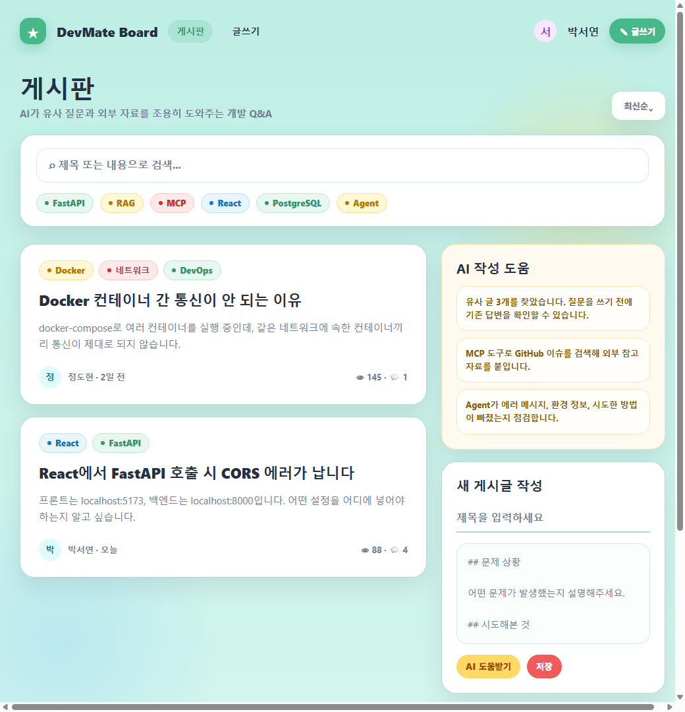

# Screen Flow v0.1

## 1. 목적

이 문서는 AI 개발 Q&A 게시판의 화면 목록과 사용자 흐름을 정의한다.
React 구현 전에 어떤 화면이 필요하고, 각 화면에서 어떤 데이터를 보여주며, 어떤 API를 호출하는지 정리한다.

## 2. 화면 목업 이미지

아래 이미지는 초기 React 화면 구성을 위한 고충실도 HTML 목업을 PNG로 렌더링한 것이다.

생성 방식:

```text
HTML/CSS로 실제 화면에 가까운 목업을 작성했다.
Chrome headless screenshot으로 PNG 이미지를 생성했다.
목적은 React 구현 전에 목록, 작성, 상세, AI 도움 영역의 실제 배치를 확인하는 것이다.
```



보조 자료:

```text
assets/docs/ui-mockup.html
assets/docs/wireframes.svg
```

## 3. 화면 목록

초기 화면은 아래 6개로 시작한다.

```text
/login
/signup
/posts
/posts/:postId
/posts/new
/posts/:postId/edit
```

AI 기능이 추가된 뒤에는 글 작성 화면 안에 AI 작성 도움 영역을 붙인다.
별도의 AI 전용 페이지는 초기에는 만들지 않는다.

## 4. 화면별 설계

### 3.1 로그인 화면

경로:

```text
/login
```

목적:

- 사용자가 이메일과 비밀번호로 로그인한다.

보여줄 요소:

- 이메일 입력
- 비밀번호 입력
- 로그인 버튼
- 회원가입 페이지 이동 링크
- 로그인 실패 메시지

주요 동작:

```text
로그인 버튼 클릭
→ POST /api/auth/login
→ 성공 시 access token 저장
→ /posts로 이동
```

관련 API:

```text
POST /api/auth/login
```

### 3.2 회원가입 화면

경로:

```text
/signup
```

목적:

- 사용자가 새 계정을 만든다.

보여줄 요소:

- 이메일 입력
- 닉네임 입력
- 비밀번호 입력
- 회원가입 버튼
- 로그인 페이지 이동 링크
- 회원가입 실패 메시지

주요 동작:

```text
회원가입 버튼 클릭
→ POST /api/auth/signup
→ 성공 시 /login으로 이동
```

관련 API:

```text
POST /api/auth/signup
```

### 3.3 게시글 목록 화면

경로:

```text
/posts
```

목적:

- 사용자가 게시글 목록을 보고, 검색하고, 원하는 글로 이동한다.

보여줄 요소:

- 게시글 목록
- 검색 입력창
- 태그 필터
- 페이지 이동 버튼
- 글쓰기 버튼
- 로그인/로그아웃 상태 표시

목록에 표시할 데이터:

- 게시글 제목
- 작성자 닉네임
- 태그
- 댓글 수
- 작성일

주요 동작:

```text
화면 진입
→ GET /api/posts
→ 게시글 목록 표시
```

```text
검색어 입력 후 검색
→ GET /api/posts?keyword=...
→ 검색 결과 표시
```

```text
태그 선택
→ GET /api/posts?tag=...
→ 태그 필터 결과 표시
```

```text
글쓰기 버튼 클릭
→ 로그인 상태면 /posts/new로 이동
→ 비로그인 상태면 /login으로 이동
```

관련 API:

```text
GET /api/posts
GET /api/tags
```

### 3.4 게시글 상세 화면

경로:

```text
/posts/:postId
```

목적:

- 사용자가 게시글 본문과 댓글을 확인한다.

보여줄 요소:

- 게시글 제목
- 게시글 본문
- 작성자 닉네임
- 태그
- 작성일/수정일
- 수정 버튼
- 삭제 버튼
- 댓글 목록
- 댓글 작성 입력창

주요 동작:

```text
화면 진입
→ GET /api/posts/{post_id}
→ GET /api/posts/{post_id}/comments
→ 게시글과 댓글 표시
```

```text
수정 버튼 클릭
→ 작성자일 경우 /posts/{postId}/edit로 이동
```

```text
삭제 버튼 클릭
→ DELETE /api/posts/{post_id}
→ 성공 시 /posts로 이동
```

```text
댓글 작성
→ POST /api/posts/{post_id}/comments
→ 성공 시 댓글 목록 갱신
```

관련 API:

```text
GET /api/posts/{post_id}
DELETE /api/posts/{post_id}
GET /api/posts/{post_id}/comments
POST /api/posts/{post_id}/comments
DELETE /api/comments/{comment_id}
```

### 3.5 게시글 작성 화면

경로:

```text
/posts/new
```

목적:

- 로그인한 사용자가 새 게시글을 작성한다.

보여줄 요소:

- 제목 입력
- 본문 입력
- 태그 입력
- 저장 버튼
- 취소 버튼
- AI 작성 도움 영역

초기 버전의 AI 작성 도움 영역:

```text
아직 실제 AI 기능은 구현하지 않는다.
나중에 RAG, MCP, Agent 결과를 이 화면에 붙인다.
```

AI 기능 추가 후 표시할 요소:

- 유사 게시글 추천
- 기존 답변 요약
- 외부 GitHub 이슈 추천
- 질문 개선 제안
- 답변 초안

주요 동작:

```text
저장 버튼 클릭
→ POST /api/posts
→ 성공 시 /posts/{postId}로 이동
```

AI 기능 추가 후 동작:

```text
AI 도움받기 버튼 클릭
→ POST /api/ai/agent/assist-writing
→ RAG/MCP/Agent 결과 표시
```

관련 API:

```text
POST /api/posts
POST /api/ai/agent/assist-writing
POST /api/ai/posts/similar
```

### 3.6 게시글 수정 화면

경로:

```text
/posts/:postId/edit
```

목적:

- 작성자가 기존 게시글을 수정한다.

보여줄 요소:

- 기존 제목
- 기존 본문
- 기존 태그
- 저장 버튼
- 취소 버튼

주요 동작:

```text
화면 진입
→ GET /api/posts/{post_id}
→ 기존 값 표시
```

```text
저장 버튼 클릭
→ PATCH /api/posts/{post_id}
→ 성공 시 /posts/{postId}로 이동
```

관련 API:

```text
GET /api/posts/{post_id}
PATCH /api/posts/{post_id}
```

## 5. 사용자 흐름

### 4.1 비회원 글 조회 흐름

```text
사용자
→ /posts 접속
→ 게시글 목록 확인
→ 게시글 클릭
→ /posts/:postId 이동
→ 게시글 상세와 댓글 확인
```

특징:

- 비회원도 글 목록과 상세는 볼 수 있다.
- 비회원은 글 작성, 댓글 작성, 수정, 삭제를 할 수 없다.

### 4.2 회원가입과 로그인 흐름

```text
사용자
→ /signup 접속
→ 이메일/닉네임/비밀번호 입력
→ 회원가입 성공
→ /login 이동
→ 이메일/비밀번호 입력
→ 로그인 성공
→ /posts 이동
```

### 4.3 게시글 작성 흐름

```text
로그인 사용자
→ /posts 접속
→ 글쓰기 클릭
→ /posts/new 이동
→ 제목/본문/태그 입력
→ 저장 클릭
→ POST /api/posts
→ 저장 성공
→ /posts/:postId 이동
```

AI 기능 추가 후:

```text
로그인 사용자
→ /posts/new에서 제목/본문 입력
→ AI 도움받기 클릭
→ RAG로 유사 게시글 검색
→ MCP로 외부 개발 정보 검색
→ Agent가 질문 개선 제안
→ 사용자가 글을 보완
→ 저장
```

### 4.4 댓글 작성 흐름

```text
로그인 사용자
→ /posts/:postId 접속
→ 댓글 입력
→ 등록 클릭
→ POST /api/posts/{post_id}/comments
→ 댓글 목록 갱신
```

### 4.5 게시글 수정/삭제 흐름

```text
작성자
→ /posts/:postId 접속
→ 수정 클릭
→ /posts/:postId/edit 이동
→ 내용 수정
→ 저장
→ PATCH /api/posts/{post_id}
→ /posts/:postId 이동
```

```text
작성자
→ /posts/:postId 접속
→ 삭제 클릭
→ DELETE /api/posts/{post_id}
→ /posts 이동
```

## 6. 권한별 가능 행동

| 행동 | 비회원 | 로그인 사용자 | 작성자 |
|---|---|---|---|
| 글 목록 조회 | 가능 | 가능 | 가능 |
| 글 상세 조회 | 가능 | 가능 | 가능 |
| 글 작성 | 불가 | 가능 | 가능 |
| 글 수정 | 불가 | 불가 | 가능 |
| 글 삭제 | 불가 | 불가 | 가능 |
| 댓글 조회 | 가능 | 가능 | 가능 |
| 댓글 작성 | 불가 | 가능 | 가능 |
| 댓글 삭제 | 불가 | 본인 댓글만 가능 | 본인 댓글만 가능 |
| AI 작성 도움 | 불가 | 가능 | 가능 |

## 7. 초기 구현 우선순위

React를 만들 때 한 번에 모든 화면을 구현하지 않는다.

초기 구현 순서:

```text
1. /posts 목록 화면
2. /posts/:postId 상세 화면
3. /posts/new 작성 화면
4. /login
5. /signup
6. /posts/:postId/edit 수정 화면
```

이유:

- 처음 목표는 로그인 없이 게시글 목록, 상세, 작성 흐름을 먼저 확인하는 것이다.
- 인증은 이후 단계에서 붙인다.
- AI 작성 도움 영역은 화면 자리만 만들어두고, 실제 기능은 나중에 붙인다.

## 8. 다음 단계

화면 흐름이 정리되면 다음 단계로 넘어간다.

```text
백엔드 실행 환경 확인
→ 가상환경 생성
→ 의존성 설치
→ FastAPI 서버 실행
→ /health 확인
```

단, 실행 명령은 사용자가 직접 터미널에서 실행하고,
Codex는 각 명령의 의미와 성공/실패 기준을 설명한다.
